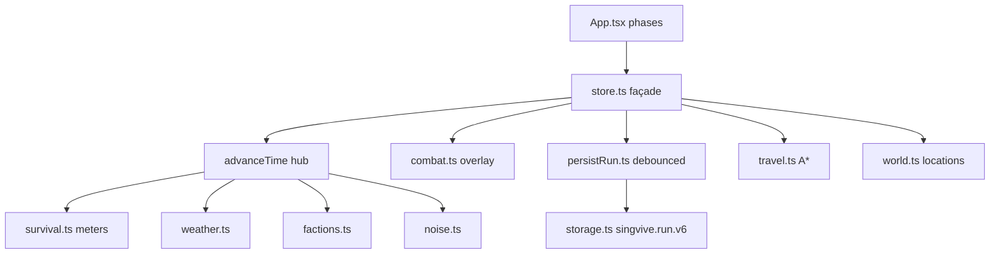

# Singvive Systems

## Architecture map



| Layer | Path | Role |
|-------|------|------|
| Pure logic | `src/game/*.ts` | Deterministic, seed-driven — no React/DOM |
| Store façade | `src/game/store.ts` | Single Zustand store; all player actions |
| UI | `src/screens/`, `src/components/` | Phase router + map overlay |
| Scores API | `worker/index.ts`, `src/api/` | Honor board only — not gameplay |
| Map data | `public/pois.json` etc. | Pre-baked; `npm run bake:*` is manual |

**Phases:** `menu → character → spawn → game → death`. Combat is an **overlay** inside `game`, not a phase.

## Where to add a new mechanic

1. Create `src/game/<system>.ts` with pure functions (params in, new values out)
2. Fork RNG: `rng.fork('subsystem:key')` — never `Math.random()` in gameplay
3. Wire into `advanceTime` and/or a store action in `store.ts`
4. Call `persist()` at action sites (debounced via `schedulePersist`)
5. If player-facing rules change → update `src/i18n/messages/*.json` guide keys + `GAME_DESIGN.md`

Do **not** add a second Zustand store or dump logic only into the façade.

## Key files

| System | File(s) |
|--------|---------|
| Time hub | `store.ts` → `advanceTime` |
| Persistence | `persistRun.ts`, `storage.ts` (`singvive.run.v6`) |
| Combat | `combat.ts` (pure resolve), `CombatPanel` (UI) |
| Travel | `travel.ts`, `route.ts` |
| Inventory | `inventory.ts`, `packGrid.ts` |
| World / POIs | `world.ts`, `bakedPois.ts`, `poi.ts` |
| Loot | `loot.ts`, `data/items.json` |

## Cross-module changes

Before editing `store.ts` or touching combat + travel + persist together:

1. Query **user-codebase-memory** MCP: `search_graph` (e.g. `"combatTick persist advanceTime"`)
2. Use `trace_path` from entry action to side effects
3. Run `npm test` after logic changes

## Seed reproducibility checklist

- [ ] All gameplay RNG uses `Rng` with `fork()` tags
- [ ] No `Math.random()` in `src/game/` (except `randomSeed()` in `rng.ts`)
- [ ] Same seed + spawn reproduces world, encounters, loot
- [ ] Persist schema stays `singvive.run.v6` unless migration added

## Browser playtest smoke path

Run after gameplay UI or store changes:

```
Playtest Progress:
- [ ] npm run dev (port 5190)
- [ ] Menu → character create → spawn select
- [ ] Pick urban spawn ~1.352, 103.8198 (Orchard — dense POIs)
- [ ] CDP: window.__game.getState() — phase=game, locations populated
- [ ] Trek to one POI, run one search session
- [ ] Trigger one combat, resolve or flee
- [ ] Wait 5s or tab away — persist flush (continue slot updates)
- [ ] Screenshot death or extract screen if testing those flows
```

Dev server: **port 5190** (not 5173). `window.__game` exposes the Zustand store in DEV.

## Verification commands

```bash
npm run lint
npm run test      # pure game logic (Vitest)
npm run build     # tsc + Vite
```

## Deploy checklist

```bash
npm run lint && npm run build
npm run db:migrate:local   # only if migrations/ changed
npm run deploy
```

Do **not** run `npm run bake:*` unless explicitly updating committed map data.

## Performance guardrails

- GameScreen: scalar store selectors only — not whole `combat` object
- POI layers: viewport-culled (`getBounds().pad(0.2)`)
- `locationsForSave`: strip bake-known outlines; rehydrate on continue
- Prefetch bake on spawn screen — no extra full-island scans
